# Git

- [Book](https://git-scm.com/book/zh/v2)
- [Commit message 和 Change log 编写指南](http://www.ruanyifeng.com/blog/2016/01/commit_message_change_log.html)
- [Git Commit 日志风格指南](https://open.leancloud.cn/git-commit-message/)
- [Git hooks made easy](https://github.com/typicode/husky)

以下为可用的 `commit` 类型及意义。

类型	| 说明
---|---
feat	    | feature - 所有实现新功能、新行为的 commit 都属这个类型
fix	      | 修正缺陷的 commit
chore	    | 日常维护性的改动，例如 linter 的配置等
test	    | 与测试有关的改动
refactor	| 不改变行为的对代码结构的改进
style	    | 对代码风格的修正（仅限缩进、空行一类的简单改动，对结构有影响的用 refactor）
cosm	    | cosmetic - 不改变行为的对界面的纯视觉上的改动
docs	    | 对文档的改进，包括对外文档和代码注释
build	    | 和构建流程、持续集成等有关的改动

### git常用命令
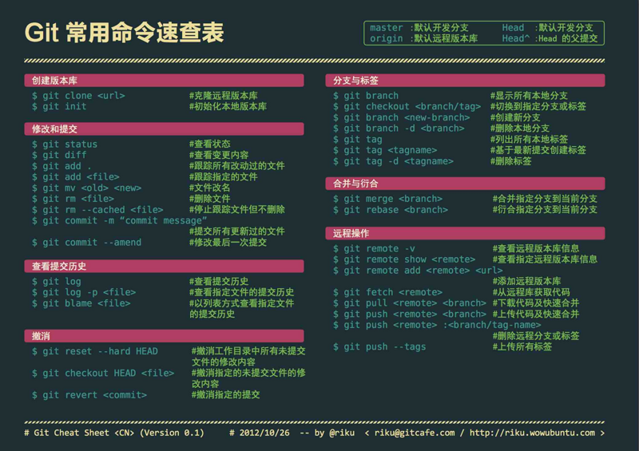

### 创建版本库
```sh
git clone <url>
git init
```

### 修改和提交
```sh
git status
git diff
git add .
git add <file>
git mv <old> <new>                # 文件改名
git rm <file>
git rm --cached <file>
git rm -r folder                  # 删除文件夹
git commit -m "commit message"
git commit --amend                # 修改最后一次提交，合并上一次提交
git commit -am "commit message"   # add 与 commit 合并为一步
```

### 查看提交历史
```sh
git log
git log -p <file>
git blame <file>
git diff --shortstat "@{0 day ago}" # 今天写了多少行代码
git log --pretty=oneline --abbrev-commit
```

### 撤销
```sh
git reset HEAD <file>                 # 撤销上一次add file， 如果HEAD后面不带参数，全部撤销
git reset --hard HEAD                 # 将工作区、暂存取和HEAD保持一致
git checkout HEAD <file>
git checkout .                        # 撤销对所有已修改但未提交的文件的修改，但不包括新增的文件
git checkout [filename]               # 撤销对指定文件的修改，[filename]为文件名
git reset --hard  [commit-hashcode]   # 回退到任意已经提交过的版本。已 add / commit 但未 push 的文件也适用。
git revert <commit>
git reset HEAD                        # 撤销所有暂存（add）的文件
git reset HEAD <file>...              # 取消暂存的文件
git reset --soft HEAD^                # 撤销commit
git reflog                            # 查看历史变更记录
git reset --hard HEAD@{n}             # 撤销 git pull 操作，回退到 pull 错误之前
```

### 分支与标签
```sh
git branch                            # 查看分支
git branch -a                         # 查看远程分支git
git branch <name>                     # 创建分支
git checkout <name>                   # 切换分支
git checkout -b <name>                # 创建+切换分支
git checkout -b origin/<name>         # 根据远程分支创建+切换分支
git merge <name>                      # 合并某分支到当前分支
git branch -d <name>                  # 删除分支
git push origin <name>                # 推送远程分支
git push origin --delete <name>       # 删除远程分支
git tag                               # 列出本地所有标签
git tag <tagname>                     # 基于最新提交创建标签
git tag -d <tagname>                  # 删除本地标签
git tag <name> <commit id>            # 根据commit id创建标签
git push origin :refs/tags/[tagname]  # 删除远程标签
git push origin <tagname>             # 可以推送一个本地标签
git push origin --tags                # 可以推送全部未推送过的本地标签
```


### 合并与衍合
```sh
git merge <branch>                    # 合并指定分支到当前分支
git rebase <branch>                   # 衍合指定分支到当前分支
```

### 远程操作
```sh
git remote -v

```

### 其他
```sh
# 暂时将未提交的变化移除，稍后再移入
git stash
git stash pop
```

- todo http://www.sohu.com/a/251952125_663371

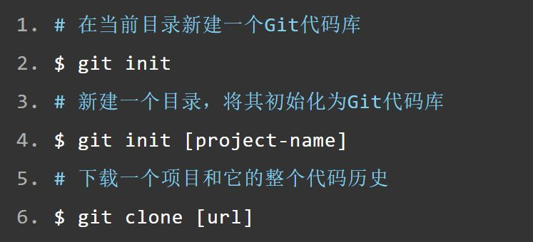
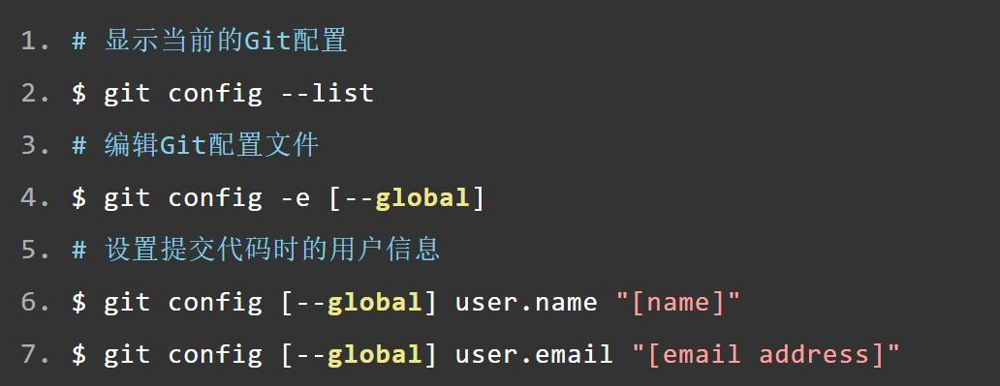
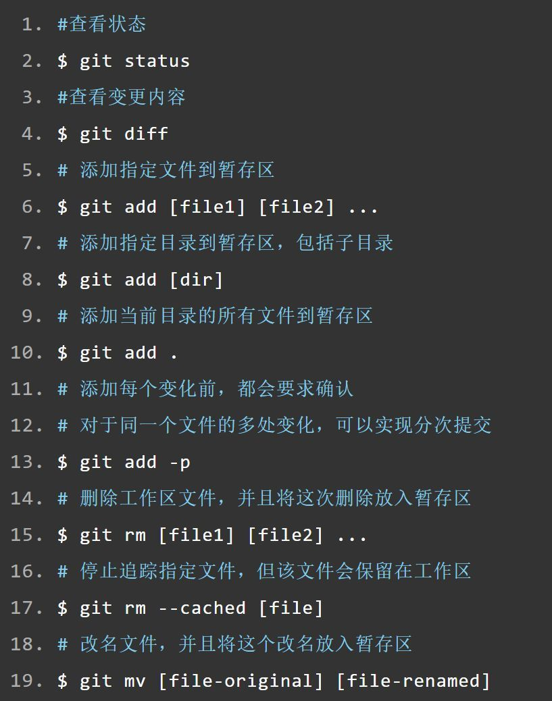
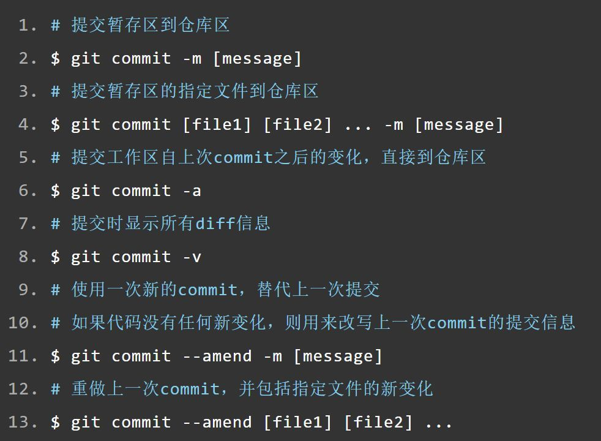
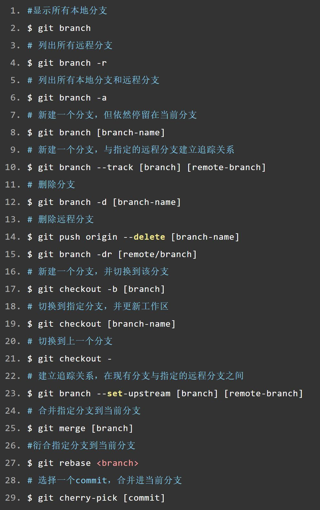
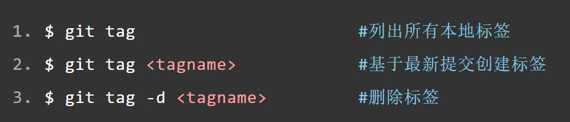
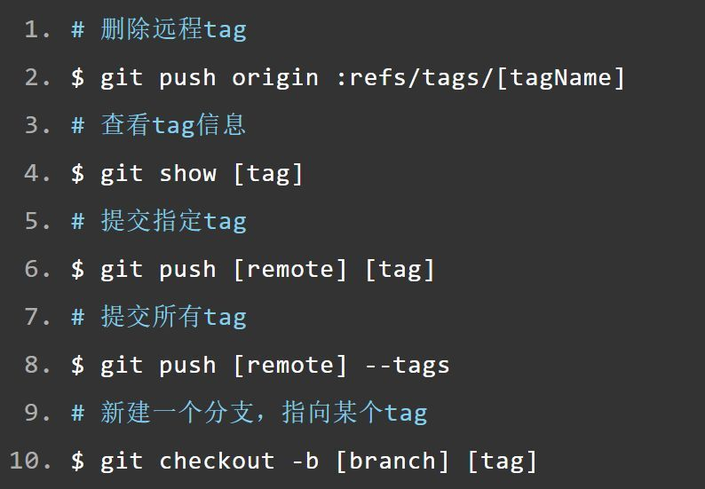
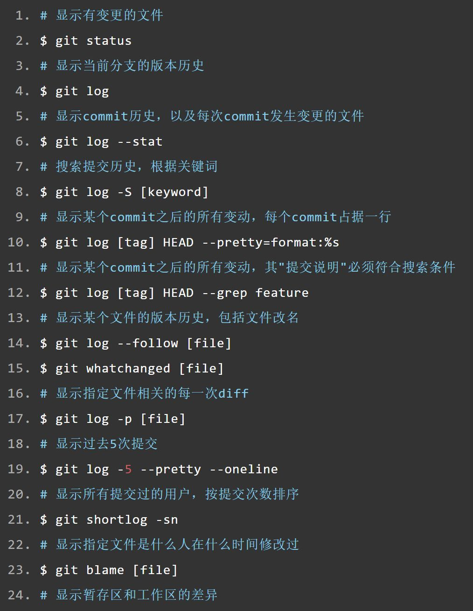
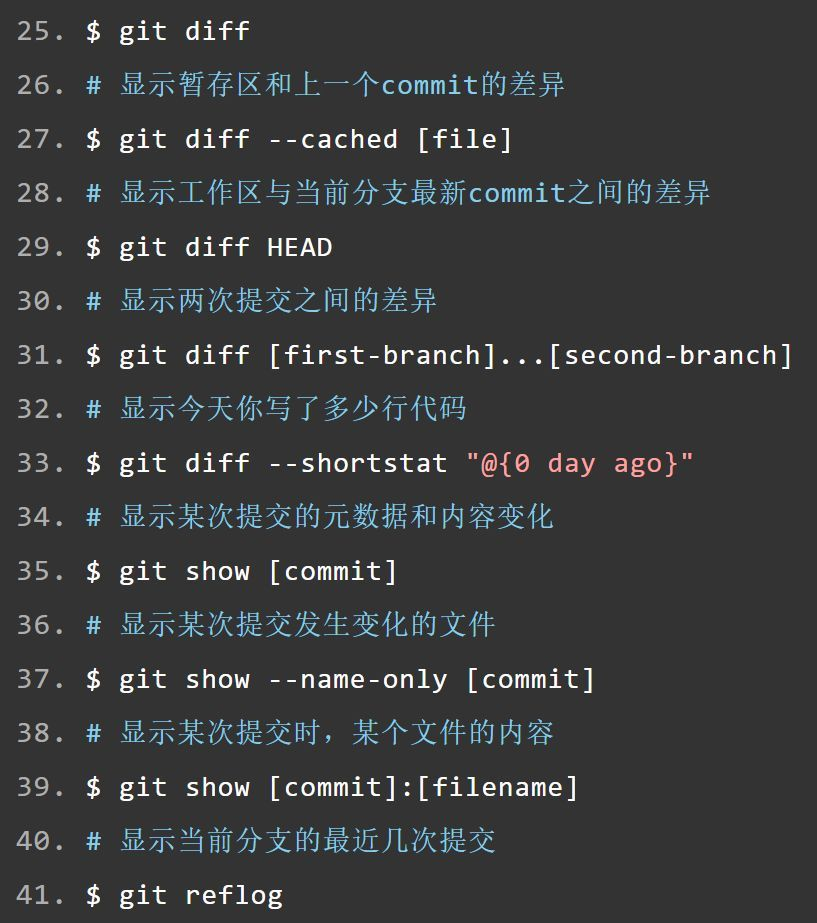
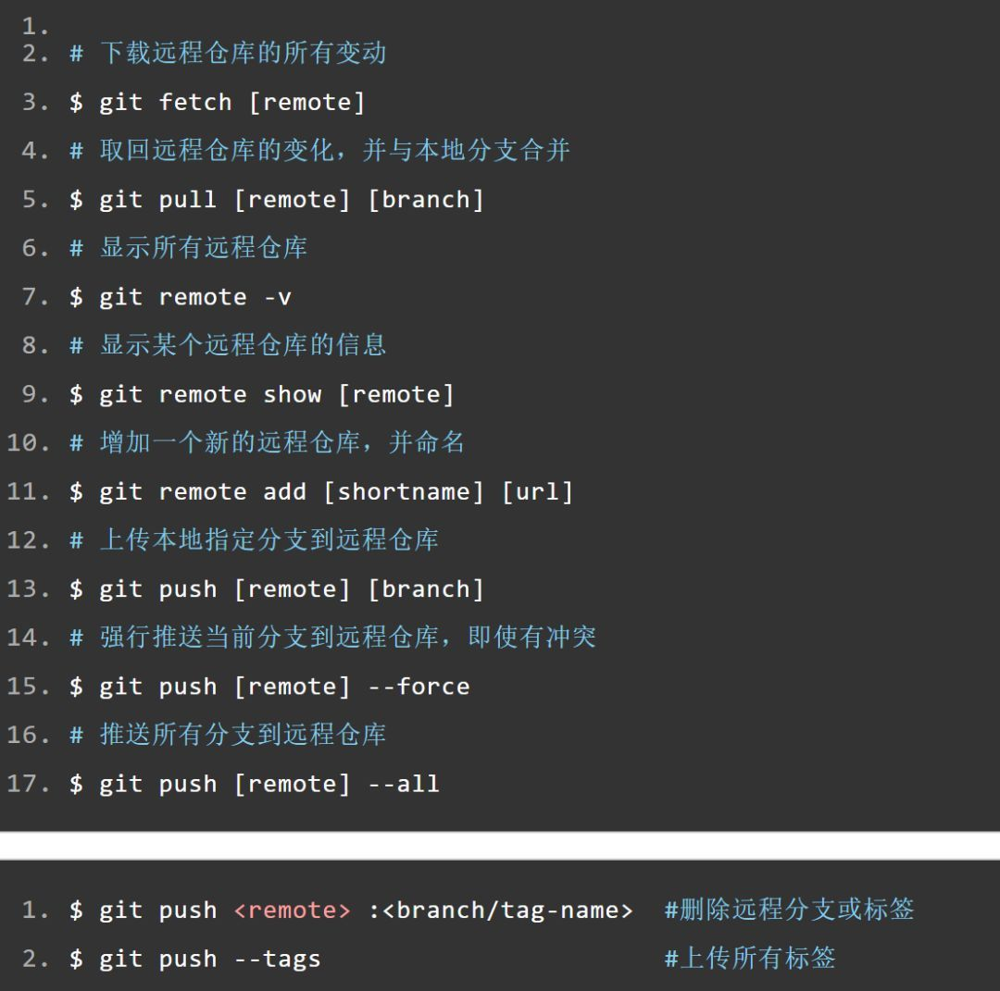
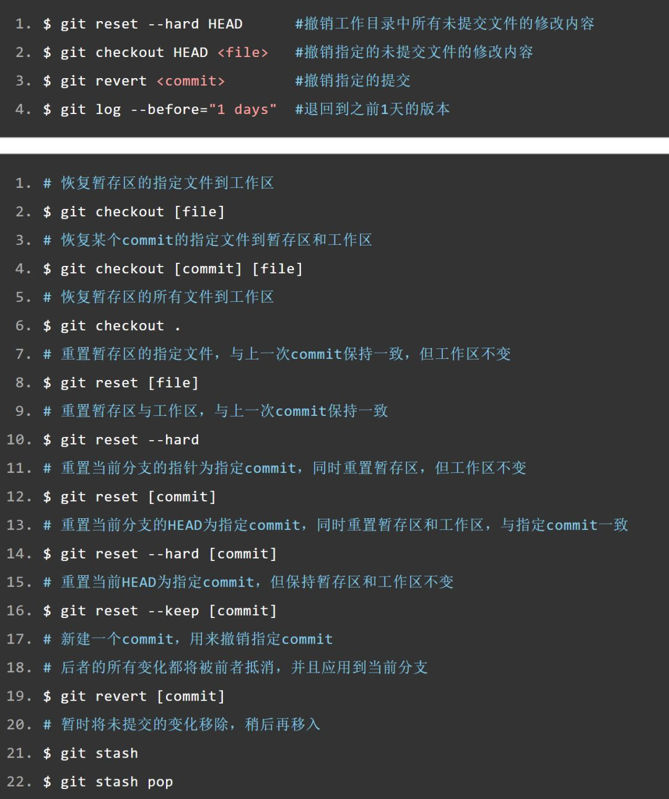
